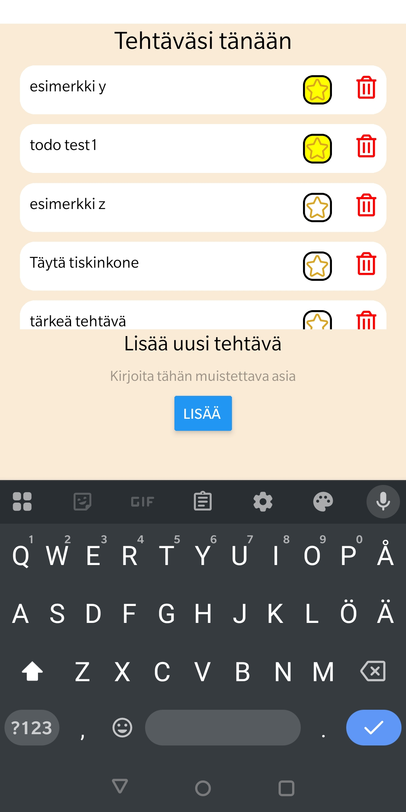

# Muistilista sovellus - React Native

Sovellus on tehty osana opinnäytetyötä, jonka aiheena on React Native.
Opinnäytetyö on toteutettu ryhmätyönä, mutta itse sovellus on osa henkilökohtaista osuuttani.

Muistilista äppi on yksinkertainen sovellus, jonka avulla käyttäjä voi kirjata itselleen muistiin tehtäviä ja muistettavia asioita.
Sovelluksessa voi lisätä uusia tehtäviä, merkitä tehtävän valmiiksi, korostaa tehtävä tärkeäksi, jolloin se nousee listan kärkeen sekä poistaa tehtävän.

Esittely sovelluksesta: https://www.youtube.com/shorts/3z5kWi3k0Oc

